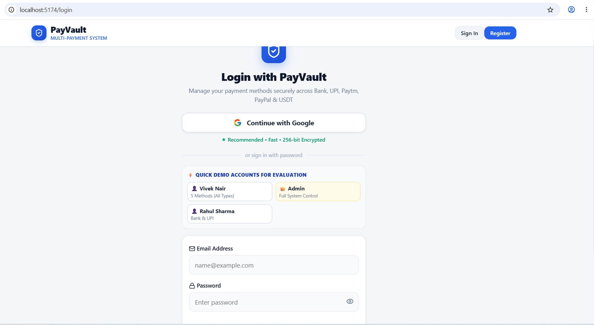
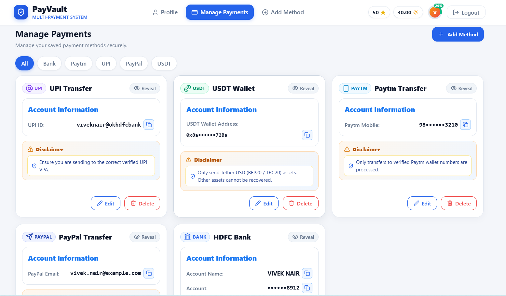
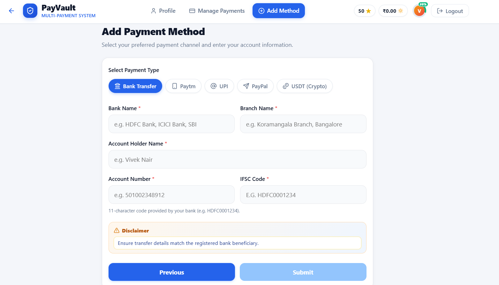
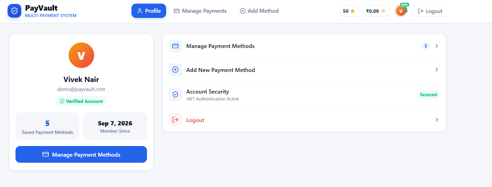
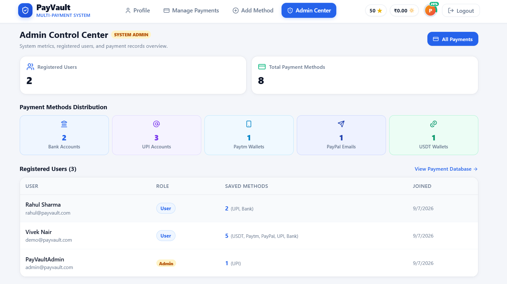
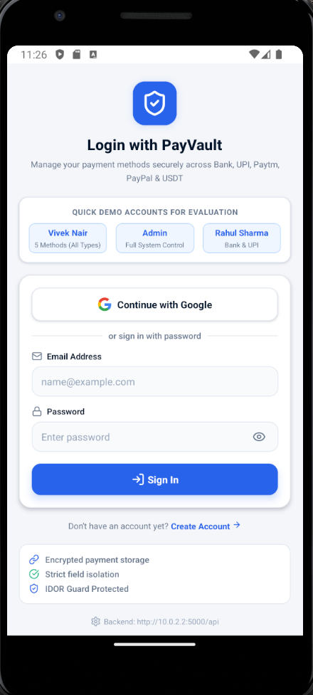
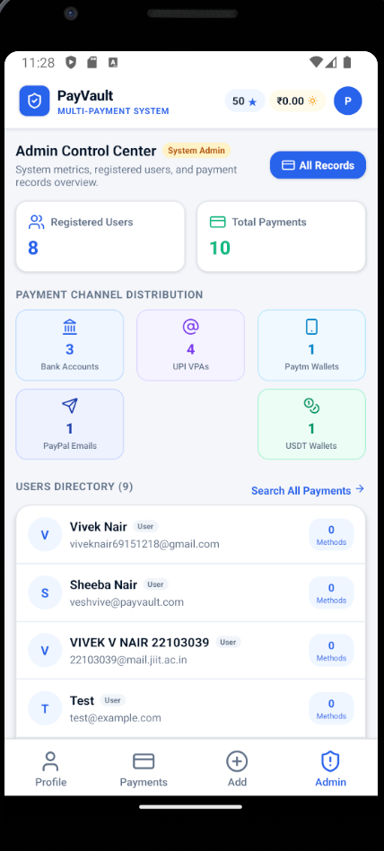

# PayVault — Multi-Payment Management System

PayVault is a secure, production-grade, full-stack payment information management platform built with the MERN stack (**MongoDB, Express.js, React.js, Node.js**) alongside a standalone native **React Native CLI (Android)** mobile client. Designed with inspiration from modern fintech interfaces, PayVault provides a unified dashboard for individuals to manage diverse payment methods while giving platform administrators deep search, filter, and analytics capabilities.

---

##  Application User Flow & Screenshots

### 1. Web Authentication & Google Sign-In

> **Step 1 — Web Login Screen**: Features verified Google Identity Services sign-in, quick evaluation demo account selectors (**Vivek Nair**, **Admin**, **Rahul Sharma**), and password authentication.

---

### 2. Manage Payments Portfolio

> **Step 2 — Payments Dashboard**: Unified overview of all saved payment methods across 5 types (**Bank**, **UPI**, **Paytm**, **PayPal**, **USDT**). Includes dynamic category filter pills, sensitive number masking with 1-click reveal, one-touch copy buttons `[📋]`, transfer disclaimer notices, and edit/delete actions.

---

### 3. Dynamic Add / Edit Payment Method

> **Step 3 — Dynamic Form & Field Isolation**: Interactive payment method creation with horizontal channel pills. Only fields relevant to the selected payment method are displayed and stored (e.g. Bank displays IFSC & Account Number; UPI displays VPA). Switching types automatically prunes obsolete fields from the database.

---

### 4. User Profile & Account Security

> **Step 4 — Profile & Settings**: Displays verified account badge, registered email, total active payment methods count, membership duration, security audit status, and quick navigation shortcuts.

---

### 5. Admin Control Center & Analytics

> **Step 5 — Web Administrator Dashboard**: Accessible exclusively to users with `role: 'admin'`. Displays high-level platform metrics, total payment methods, distribution charts across all 5 payment types, and the registered users directory with access to the searchable payment database.

---

### 6. Mobile Application — Authentication & Native Google Sign-In (Android)

> **Step 6 — Native Mobile Login**: Production-grade React Native CLI Android interface running on Pixel 3a (Android 14 API 34). Features verified native Google Sign-In via Google Play Services (`@react-native-google-signin/google-signin`), 1-tap quick evaluation demo account selection pills (**Vivek Nair**, **Admin**, **Rahul Sharma**), and secure JWT session persistence via AsyncStorage.

---

### 7. Mobile Application — Admin Control Center & Channel Breakdown (Android)

> **Step 7 — Mobile Administrator Dashboard**: Complete administrator control center on mobile. Displays real-time aggregate metrics (Registered Users, Total Saved Payments), color-coded channel distribution cards across all 5 payment types (Bank, UPI, Paytm, PayPal, USDT), and an interactive registered user directory.

---

## Features

- **Multi-Channel Payment Management**: First-class support for 5 payment methods:
  - **Bank Accounts**: Account Number, Account Holder Name, Bank Name, IFSC Code.
  - **UPI VPAs**: UPI ID (e.g. `user@okhdfcbank`).
  - **Paytm Wallets**: 10-digit Indian Mobile Number.
  - **PayPal**: Registered PayPal Email Address.
  - **USDT Wallets**: TRC-20 / ERC-20 Cryptocurrency Wallet Address.
- **Strict Dynamic Field Isolation**: Only fields applicable to the selected payment channel are collected and persisted. Switching types cleanses and unsets obsolete fields at the database level.
- **Data Encryption & Blind Indexing**: Sensitive financial numbers are encrypted at rest using **AES-256-GCM** with blind indexing (HMAC-SHA256) for exact-match admin queries without storing plaintext.
- **Sensitive Field Masking**: Account numbers, UPI IDs, and wallet addresses are masked by default (`••••••••1234`) with explicit 1-click reveal and copy functionality.
- **Role-Based Access Control (RBAC)**: Distinct permissions for standard users and platform administrators.
- **Admin Control Center**: System-wide statistics, channel distribution analytics, user directory, and full searchable payment audit log with pagination.
- **Multi-Platform Google Sign-In**:
  - Web: Google Identity Services OAuth 2.0.
  - Mobile: Native Google Play Services Sign-In via `@react-native-google-signin/google-signin`.
  - Backend: Dual Client ID verification supporting both Web and Android credentials.
- **100% Cloud-Independent Mobile Client**: Pre-compiled standalone release APK configured to connect directly to the live Render cloud backend (`https://payvault-kudl.onrender.com/api`) 24/7 on 4G/5G mobile data.

---

## Technology Stack

| Layer | Technologies |
| :--- | :--- |
| **Backend API** | Node.js, Express.js (REST API, JWT, Helmet, Express Rate Limit) |
| **Database** | MongoDB Atlas (Mongoose ODM, compound indexes, blind indexes) |
| **Web Frontend** | React.js 18, Vite, React Router DOM, Lucide Icons, Axios |
| **Mobile Client** | React Native CLI 0.76.6, React Navigation v7, AsyncStorage, Lucide React Native |
| **Native Android** | Android SDK API 34, Gradle 8.10.2, CMake C++ NDK, Hermes JS Engine |
| **Authentication** | JWT (JSON Web Tokens), Google OAuth 2.0 (Dual Web & Android ID verification) |
| **Cryptography** | AES-256-GCM, HMAC-SHA256 Blind Indexing, Bcrypt (10 salt rounds) |
| **Testing** | Jest, Supertest, MongoDB Memory Server (27/27 integration tests) |
| **Cloud Deployment** | Backend hosted live on Render, Database hosted on MongoDB Atlas |

---

## Repository Structure

```
PayVault/
├── .env.example                     # Root environment variable template
├── .gitignore                       # Unified gitignore for all sub-projects
├── README.md                        # Complete project documentation
├── Screenshots/                     # Verified walkthrough screenshots (1 to 7)
│   ├── image1.png                   # Web login screen
│   ├── image2.png                   # Web manage payments dashboard
│   ├── image3.png                   # Web dynamic add/edit payment
│   ├── image4.png                   # Web user profile & security
│   ├── image5.png                   # Web admin control center & charts
│   ├── image6.png                   # Mobile login with Google Auth & pills
│   └── image7.png                   # Mobile admin control center & metrics
├── backend/                         # Express.js REST API server
│   ├── .env.example                 # Backend environment variable template
│   ├── app.js                       # Express app configuration & middleware
│   ├── server.js                    # Server bootstrap & database connection
│   ├── package.json                 # Backend dependencies & scripts
│   ├── config/                      # Database configuration
│   ├── controllers/                 # Route controllers (auth, payment, admin)
│   ├── middleware/                  # JWT auth, RBAC, error handlers
│   ├── models/                      # Mongoose models (User, Payment)
│   ├── routes/                      # API route definitions
│   ├── scripts/                     # Seed scripts & database migrations
│   ├── tests/                       # Jest integration test suite (27 tests)
│   ├── utils/                       # Cryptography, AES-256-GCM, blind indexing
│   └── validators/                  # Payment input validators
├── frontend/                        # React.js web client (Vite)
│   ├── .env.example                 # Frontend environment template
│   ├── index.html                   # HTML entry point
│   ├── package.json                 # Frontend dependencies & scripts
│   ├── vite.config.js               # Vite build configuration
│   └── src/                         # Components, pages, context, services, styles
└── mobile/                          # Standalone native React Native CLI app
    ├── .env.example                 # Mobile environment template
    ├── PayVault-v1.0.0.apk          # Production release Android APK
    ├── package.json                 # Mobile dependencies & scripts
    ├── metro.config.js              # Metro bundler configuration
    ├── babel.config.js              # Babel transpiler configuration
    ├── index.js                     # React Native app registration
    ├── android/                     # Android native project (Gradle, CMake, NDK)
    └── src/                         # Screens, components, navigation, theme
```

---

##  Getting Started

### 1. Prerequisites
- **Node.js**: v18 or higher
- **MongoDB**: Local MongoDB instance (`mongodb://127.0.0.1:27017/payvault`) or a MongoDB Atlas URI
- **Git**
- **For Android Development**: Android Studio with SDK API 34+ and platform tools (`adb`)

### 2. Clone the Repository
```bash
git clone https://github.com/your-username/PayVault.git
cd PayVault
```

---

### 3. Backend Setup

```bash
cd backend
npm install
cp .env.example .env     # Configure your MONGO_URI and JWT_SECRET
npm run seed:admin       # Seeds admin and demo evaluation accounts
npm run dev              # Starts Express server on http://localhost:5000
```

---

### 4. Web Frontend Setup

```bash
cd ../frontend
npm install
cp .env.example .env
npm run dev              # Starts Vite client on http://localhost:5173
```

Open `http://localhost:5173` in your browser.

To create an optimized production build:
```bash
npm run build            # Generates dist/ bundle in ~2 seconds
```

---

## Mobile Application (React Native CLI — Android)

### Standalone Release APK (100% Cloud Independent)
A standalone release APK is compiled and ready for immediate evaluation:
- **APK Path**: [`mobile/PayVault-v1.0.0.apk`](file:///c:/Users/HP/Downloads/PayVault/mobile/PayVault-v1.0.0.apk)
- **Live Cloud API**: Connected by default to `https://payvault-kudl.onrender.com/api`.
- **Zero Laptop Required**: Runs independently on 4G/5G mobile data from anywhere in the world.
- **Direct ADB Install**:
  ```powershell
  adb install -r mobile/PayVault-v1.0.0.apk
  ```
- **Physical Phone Sideloading**: Transfer `PayVault-v1.0.0.apk` to any Android phone and tap to install.
- **Built-in Host Switcher**: Includes 1-tap presets on the Login screen for ** Cloud Production (Render)**, ** Local Wi-Fi LAN**, and ** Local Emulator**.

### Running Mobile from Source (Development Mode)

```powershell
cd mobile
npm install

# Connect ADB reverse port forwarding for local backend:
$env:LOCALAPPDATA\Android\Sdk\platform-tools\adb.exe reverse tcp:8081 tcp:8081
$env:LOCALAPPDATA\Android\Sdk\platform-tools\adb.exe reverse tcp:5000 tcp:5000

# Start Metro bundler:
npm start

# In a separate terminal, launch on Android emulator:
npm run android
```

### Rebuilding the Release APK
```powershell
cd mobile/android
.\gradlew.bat assembleRelease
```
The compiled output is placed at `mobile/android/app/build/outputs/apk/release/app-release.apk`.

---

## API Endpoints

### Authentication (`/api/auth`)
| Method | Endpoint | Description | Auth Required |
| :--- | :--- | :--- | :--- |
| `POST` | `/api/auth/register` | Register new user account | No |
| `POST` | `/api/auth/login` | Email & password authentication | No |
| `POST` | `/api/auth/google` | Google OAuth token verification | No |
| `GET` | `/api/auth/me` | Fetch authenticated user profile | Yes (JWT) |

### Payments (`/api/payments`)
| Method | Endpoint | Description | Auth Required |
| :--- | :--- | :--- | :--- |
| `GET` | `/api/payments` | List payments for authenticated user (filter by type) | Yes (JWT) |
| `POST` | `/api/payments` | Create a new payment method with channel validation | Yes (JWT) |
| `GET` | `/api/payments/:id` | Get single payment method (IDOR protected) | Yes (JWT) |
| `PUT` | `/api/payments/:id` | Update payment & prune obsolete fields on type switch | Yes (JWT) |
| `DELETE` | `/api/payments/:id` | Delete payment method (ownership verified) | Yes (JWT) |

### Administration (`/api/admin`)
| Method | Endpoint | Description | Auth Required |
| :--- | :--- | :--- | :--- |
| `GET` | `/api/admin/stats` | Channel distribution & aggregate platform counts | Yes (Admin) |
| `GET` | `/api/admin/users` | Registered users directory | Yes (Admin) |
| `GET` | `/api/admin/payments` | Searchable payment audit log with pagination | Yes (Admin) |

---

## Security Architecture

1. **IDOR Prevention**: All payment routes verify ownership (`payment.user.toString() === req.user._id.toString()`). Unauthorized requests are rejected with HTTP 403 Forbidden.
2. **Dynamic Field Isolation**: Switching payment types triggers an automatic `$unset` operation in MongoDB, ensuring obsolete sensitive credentials never linger in the database.
3. **AES-256-GCM Encryption**: Protected fields are encrypted at rest with a unique IV per entry and cryptographic authentication tags.
4. **Blind Indexing (HMAC-SHA256)**: Enables exact-match administrative searches over encrypted fields without storing or indexing plaintext identifiers.
5. **Masking & UI Safeguards**: Financial credentials remain masked in the UI by default (`••••••••6735`), requiring an explicit user tap to reveal.
6. **Password Security**: Passwords hashed with `bcrypt` (10 salt rounds) and excluded from query projections.
7. **HTTP Hardening**: Configured with `helmet` for secure HTTP headers, sanitized CORS origin whitelisting, and `express-rate-limit` against brute-force attacks.

---